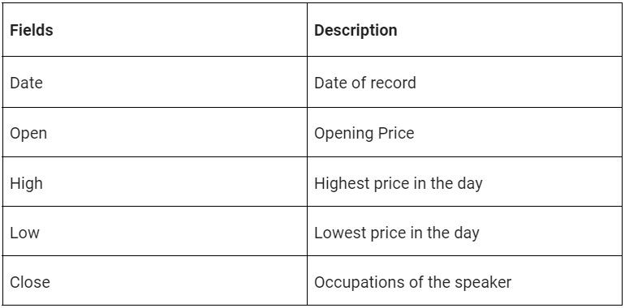
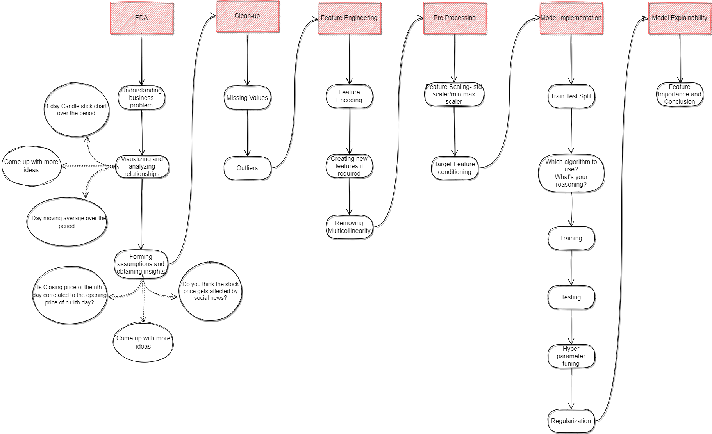

 
<!-- AlmaBetter project -->
<!-- Logo -->

  

<!-- Title -->

  AlmaBetter ML Project

  

<!-- NL photo -->

  

 

<!-- Let's get started -->
<h1 align='center'>
  Let's Get Started
</h1>
  
<!-- Title -->

  

<!-- About yes bank from alma's prespective -->

  " Yes Bank is a well-known bank in the Indian financial domain. Since 2018, it has been in the news because of the fraud case involving Rana Kapoor. Owing to this fact, it was interesting to see how that impacted the stock prices of the company and whether Time series models or any other predictive models can do justice to such situations. This dataset has monthly stock prices of the bank since its inception and includes closing, starting, highest, and lowest stock prices of every month.  The main objective is to predict the stock’s closing price of the month. "

<!-- Table of content -->

<h3>
  Table of contents
</h3>

  * History and Background
  * Operations and Expansion
  * Financial Crisis and Reconstruction
  * Shareholding and Financial Performance
  * Subsidiaries and Market Listings
  * Ratings and Future Plans
  * FAQs
  * About DataSet
  * Main Library to be used
  * Regression
  * License
  * Github Stats
  * Connext with me

<!-- From Internet prespective -->

---

 History and Background:

 

  YES BANK was founded in 1999 by Ashok Kapur, Harkirat Singh, and Rana Kapoor, with Rabobank holding a significant 75% share. The bank underwent a rebranding in 2003, which saw the resignation of Harkirat Singh due to Rabobank's considerable influence over hiring decisions. The early 2000s were challenging for YES BANK as it faced difficulties in raising capital and accumulated substantial losses, resulting in downgrades and the withdrawal of deposits. A significant leadership change occurred when Rana Kapoor was fired and later arrested for money laundering. Under the new leadership of Kumar, the bank repositioned itself and received support through the YES Bank Reconstruction Scheme 2020. By July 2020, YES BANK's follow-on public offer (FPO) saw a 95% subscription, and the State Bank of India (SBI) acquired a 30% stake in the bank.

---

 Operations and Expansion:

 

  YES BANK operates an extensive network of 1192 branches and 1301 ATMs, providing a wide array of retail and corporate banking services. The bank has embraced digital transformation by launching the YES Pay digital wallet and UPI services, forming partnerships with entities such as PhonePe and Yuva Pay. Furthermore, YES BANK has forged international partnerships to secure syndicated loans and support women entrepreneurs, in collaboration with organizations like OPIC and Wells Fargo. These initiatives demonstrate YES BANK's commitment to innovation and customer-centric services.

---

 Financial Crisis and Reconstruction:

 

  In March 2020, YES BANK faced a severe crisis when the Reserve Bank of India (RBI) imposed a 30-day moratorium due to the bank's excessive bad loans. This resulted in restrictions on withdrawals, limiting them to ₹50,000. The crisis was swiftly addressed as SBI and a consortium of banks infused capital into YES BANK, leading to a rapid recovery and the lifting of the moratorium within 12 days. Despite the recovery, the bank's ratings were downgraded by ICRA and Moody's, and founder Rana Kapoor faced legal issues, including an arrest for money laundering. Additionally, the Securities and Exchange Board of India (SEBI) proposed a fine for fraudulent bond sales, highlighting the regulatory challenges the bank faced during this period.

---

 Shareholding and Financial Performance:

 

  As of December 2023, institutional investors hold 65.99% of YES BANK's shares, with a significant portion held by Foreign Institutional Investors. In March 2018, major shareholders included foreign portfolio investors, insurance companies, and mutual funds. Recent financial developments have seen YES BANK raise funds through public offers and debt securities issuance, leading to a notable improvement in deposits and operating profits. These steps have strengthened the bank's financial foundation and positioned it for future growth.

---

 Subsidiaries and Market Listings:

 

  YES BANK has three subsidiaries: YES Securities, YES Trustee, and YES Asset Management, which expand its financial service offerings. The bank is listed on the Bombay Stock Exchange, National Stock Exchange of India, and London Stock Exchange, providing it with a robust market presence both domestically and internationally.

---

 Ratings and Future Plans:

 

  In 2020, YES BANK's ratings were upgraded by ICRA and Moody's, reflecting the positive impact of the restructuring efforts. Looking ahead, the bank plans to open 150 new branches in the fiscal year 2024, expand into affordable housing and used car loans, and achieve a milestone of 2 million credit cards by March 2024. These expansion plans underscore YES BANK's commitment to growth and its strategic focus on diversifying its service portfolio.

---

  FAQs

 
  

  

   What makes YES BANK unique in the banking sector?
  

   
  

    YES BANK's journey from financial challenges to recovery through strategic restructuring and support from major institutional investors sets it apart. Its resilience and ability to adapt to changing circumstances highlight its strength in the banking sector.
  

  

  

  

   How does YES BANK support digital banking?
  

   
  

    YES BANK offers innovative digital solutions like YES Pay and UPI services, enhancing customer convenience and engagement. These digital initiatives are part of the bank's broader strategy to leverage technology for better customer service.
  

  

  

  

   What measures has YES BANK taken to ensure financial stability?
  

   
  

    YES BANK has undergone significant restructuring, received capital infusion from SBI and other banks, and implemented robust governance practices to ensure financial stability. These measures have helped the bank regain its footing and build a solid foundation for future growth.
  

  

  

  

   What are YES BANK's plans for supporting entrepreneurs?
  

   
  

    YES BANK partners with international entities to provide syndicated loans and supports women entrepreneurs through collaborations with OPIC and Wells Fargo. These partnerships are aimed at fostering entrepreneurship and promoting inclusive economic growth.
  

  

  For more detailed information, please visit <a href="https://www.yesbank.in/" target="_blank">Yes Bank.</a>

 

<!-- About Data Set -->
<h1>About DataSet</h1>

Data consist of:

  

 
Data.head() looks like this:

  

 

To perform the ML on this project, We can considered this mapping:

  

 

<!-- library used for this Projects -->
---

 Main Libraries to be Used:

 

  * Pandas for data manipulation, aggregation 
  * Matplotlib and Seaborn for visualisation and behaviour with respect to the target variable 
  * NumPy for computationally efficient operations 
  * Scikit Learn for model training, model optimization, and metrics calculation 
  * Statsmodels: For statistical modeling and regression analysis. 

 

<!-- regreession -->
This is **Regression** Type ML Project. 
<!-- Put ML map here -->

  

  

---

  Regression:

 
  

  

   What is Supervised learning?
  

   
  

    Supervised models in machine learning are a type of model that learn to make predictions or decisions from a set of labeled data. The term "supervised" refers to the process of an algorithm learning from the training dataset, which is like a teacher supervising the learning process. Here's a more detailed explanation:  
1. Labeled Data: In supervised learning, the data used for training is labeled. This means each example in the training set consists of input data (often referred to as features) and the corresponding output (often referred to as the label or target). For example, in a dataset for house price prediction, the features might include the size of the house, the number of rooms, and the location, while the label would be the price of the house.  
2. Learning from Examples: The supervised learning algorithm analyzes the training data and produces an inferred function, which can be used for mapping new examples. This process is called learning because the algorithm improves its performance on the task as it processes more data.  
3. Types of Tasks:  
  * Classification: In classification tasks, the outputs are discrete categories. For example, identifying whether an email      is spam or not spam is a classification task. 
   * Regression: In regression tasks, the outputs are continuous values. For example, predicting the price of a house based       on various features is a regression task.  
4. Generalization: The ultimate goal of a supervised learning algorithm is to generalize from the training data to new, unseen data. This means that after training, the model should be able to make accurate predictions or decisions for examples it has never seen before.  
5. Applications: Supervised learning models are used in a wide range of applications including image and speech recognition, credit scoring, predicting customer behavior, and many more. 

In summary, supervised models are a foundational element of machine learning, where the focus is on learning a mapping from inputs to outputs, using examples where the correct outputs are known. 
  

  

  

  

   What is it called Regression?
  

   
  

    A regression is a statistical technique that relates a dependent variable to one or more independent (explanatory) variables. A regression model is able to show whether changes observed in the dependent variable are associated with changes in one or more of the explanatory variables.
  

  

 

<!-- License -->
## License
Distributed under the **MIT License.** See `LICENSE.txt` for more information.
 

<!-- GitHub stats -->
---

 📔 GitHub Stats:

 

  
  

---

<!-- Connect With me -->
<h4> Connect with me🤝: <h4>

  
  
  
  
  

  

<!-- End Part -->
<h4> Buy me a Coffee: <h4>

  

 Created with 🧠 by <a href="https://github.com/KushangShah">Kushang Shah</a>

  

